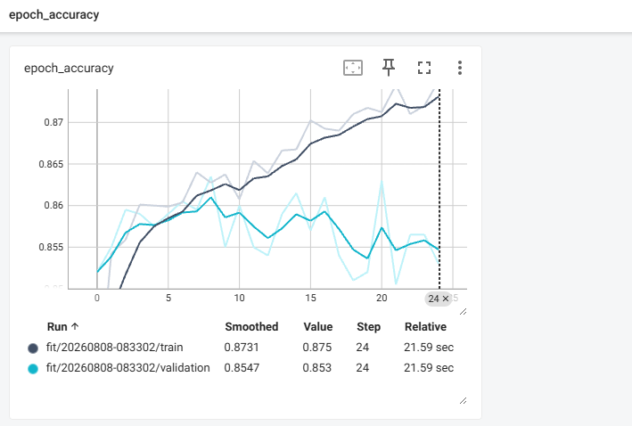
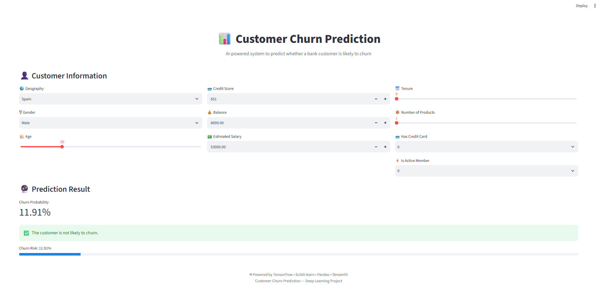

# 📊 Customer Churn Prediction using ANN

A Deep Learning project that predicts whether a bank customer is likely to churn using an Artificial Neural Network (ANN).

## 🚀 About the Project

Customer churn means a customer leaving or stopping the use of a company's services.

In this project, an Artificial Neural Network is trained to predict customer churn based on customer information such as:

- Credit Score
- Geography
- Gender
- Age
- Tenure
- Balance
- Number of Products
- Credit Card
- Active Member
- Estimated Salary

The trained model is integrated with a Streamlit web application for real-time prediction.

## 🧠 Model

The project uses an Artificial Neural Network (ANN) built with TensorFlow/Keras.

### Machine Learning Pipeline

Customer Data
↓
Data Preprocessing
↓
Label Encoding
↓
One-Hot Encoding
↓
Standard Scaling
↓
Artificial Neural Network
↓
Churn Probability
↓
Final Prediction

## 🛠️ Technologies Used

- Python
- TensorFlow
- Keras
- Scikit-learn
- Pandas
- NumPy
- Streamlit
- Jupyter Notebook
- TensorBoard

## 📊 Model Training

### Accuracy

### Training Loss

### TensorBoard

## 🖥️ Streamlit Application

The trained ANN model is connected to a Streamlit web application.

## 🔮 Prediction

The application takes customer information and returns a churn probability.

For example:

Churn Probability: 2.89%

If the probability is greater than 50%, the application predicts that the customer is likely to churn.

Otherwise, the customer is predicted to be less likely to churn.

## 📂 Project Structure

ANN-Classification-Churn-Project/

├── ANN_Project.ipynb
├── app.py
├── model.h5
├── label_encoder_gender.pkl
├── oneHOt_encoder.pkl
├── scaler.pkl
├── requirements.txt
├── README.md
├── Accuracy.png
├── Training Loss.png
├── TensorBoard screenshot.png
└── streamlit-app.png

## ⚙️ How to Run

### 1. Clone the repository

git clone YOUR_GITHUB_REPOSITORY_URL

### 2. Open the project folder

cd ANN-Classification-Churn-Project

### 3. Create virtual environment

python -m venv venv

### 4. Activate virtual environment

venv\Scripts\activate

### 5. Install dependencies

pip install -r requirements.txt

### 6. Run the application

streamlit run app.py

## 📚 What I Learned

Through this project, I learned:

- Data preprocessing
- Label Encoding
- One-Hot Encoding
- Feature Scaling
- Train/Test Split
- Artificial Neural Networks
- TensorFlow/Keras
- Model Training
- TensorBoard
- Model Saving and Loading
- Streamlit
- ML Model Deployment

## 🎯 Future Improvements

- Deploy the application online
- Improve model performance
- Add model explainability
- Improve UI/UX
- Add customer risk levels

## 👨‍💻 Author

Rohit

## 📄 Disclaimer

This project is created for educational and portfolio purposes. Predictions are based on the trained model and should not be considered guaranteed real-world outcomes.
